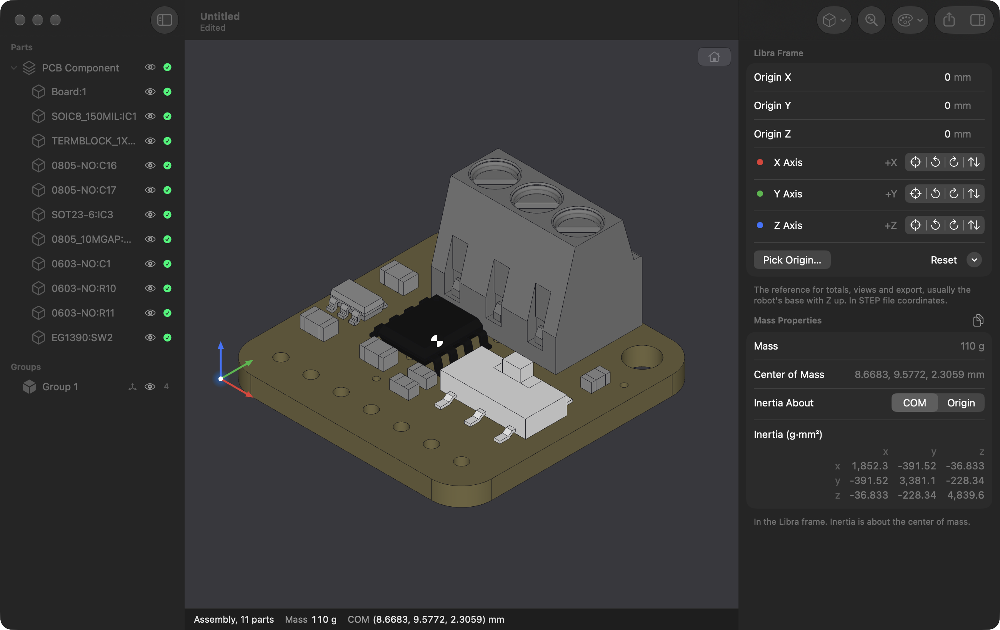

# Libra

A macOS app for working out the mass properties of a robot from its CAD model. Import a STEP assembly (for example from Fusion), give each part a mass, and Libra computes the total mass, center of mass and inertia tensor, for the whole assembly and for groups of parts. Export the results for MuJoCo, URDF, JSON or CSV.



## Features

- **STEP import** of assemblies, with the part tree shown in the sidebar. Geometry and exact volume properties come from OpenCASCADE.
- **Masses** entered per part, or for several selected parts at once. Libra assumes each part has uniform density.
- **Groups** of parts (a link of the robot, say), each with its own frame and totals.
- **Frames:** the Libra frame (usually the robot's base, Z up) is the reference for totals, views and export. Set an origin or axis by snapping to a face, edge or hole in the viewer.
- **Inertia** about the center of mass or the frame origin.
- **Export** to MuJoCo MJCF, URDF, JSON or CSV, always in SI units.
- **Viewer** with orbit, pan, zoom, standard views, hide and show, and coloring by CAD color, group or whether a part has a mass yet.

Documents are saved as self-contained `.libra` files. They keep no link to the STEP file, so a changed CAD model means a new import. In Fusion, export with File › Export and choose STEP.

## Building

Requires macOS 27, Xcode, [XcodeGen](https://github.com/yonaskolb/XcodeGen) and OpenCASCADE 7.9 from Homebrew:

```zsh
brew install xcodegen opencascade
brew pin opencascade   # the app links Homebrew's dylibs; a new version needs a rebuild
```

Then:

```zsh
export DEVELOPER_DIR=/Applications/Xcode.app/Contents/Developer
xcodegen generate
xcodebuild -project Libra.xcodeproj -scheme Libra -derivedDataPath build build
open build/Build/Products/Debug/Libra.app
```

Tests:

```zsh
(cd LibraKit && swift test)
xcodebuild -project Libra.xcodeproj -scheme Libra -derivedDataPath build test
```

## Layout

- `Libra/`: the SwiftUI app and its Metal viewer
- `LibraKit/`: everything else, as a Swift package: STEP import (C++ over OpenCASCADE), the document model, mass math, picking and exporters
- `Tools/`: generates the STEP test fixtures
- `Design/`: app icon sources
